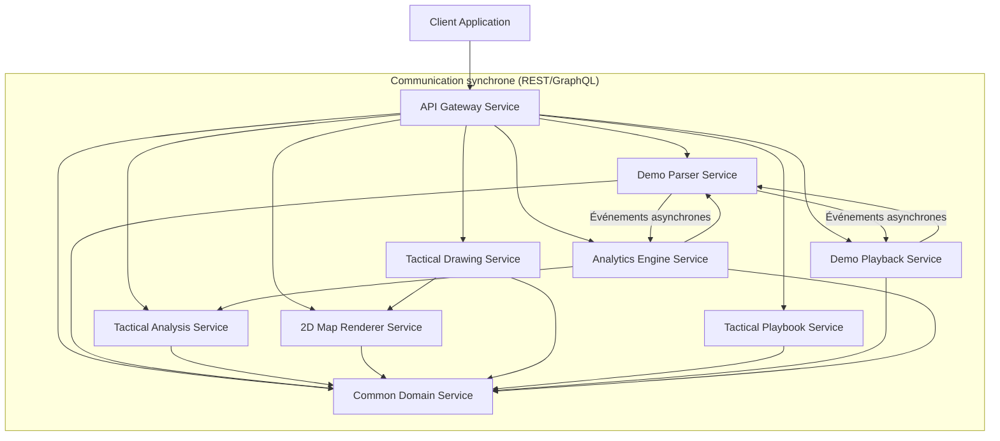
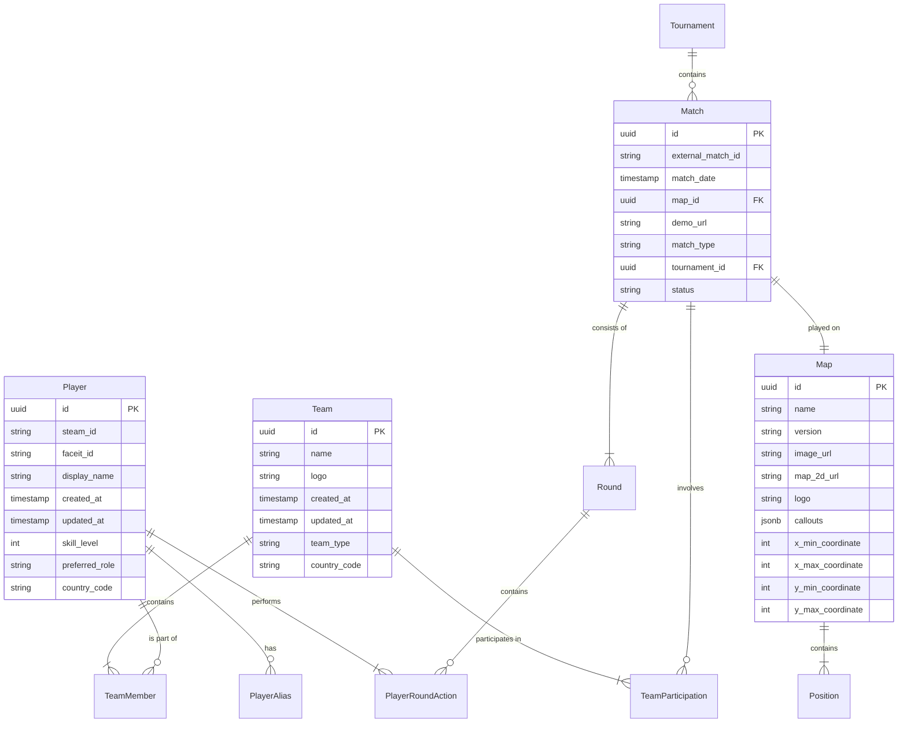

# CSAnalytics - Plateforme d'Analyse Tactique pour Counter-Strike

## Présentation commerciale

### CSAnalytics - Dépassez les statistiques, maîtrisez la stratégie

**Analysez comme les pros, jouez comme les champions**

CSAnalytics révolutionne l'analyse tactique de Counter-Strike avec une plateforme tout-en-un qui va bien au-delà des simples statistiques de K/D ratio. Notre solution complète transforme votre approche du jeu en vous offrant des insights stratégiques que les autres outils ne peuvent pas capturer.

**Plus qu'un outil, un avantage compétitif**

Contrairement aux plateformes traditionnelles qui se limitent aux métriques basiques, CSAnalytics plonge dans le cœur stratégique de Counter-Strike :

- **Analyses tactiques avancées** : Découvrez les patterns offensifs et défensifs de vos adversaires
- **Visualisation 2D interactive** : Retracez les mouvements, analysez les positionnements et visualisez les tactiques en temps réel
- **Création de playbooks tactiques** : Développez, testez et perfectionnez vos stratégies dans un environnement intuitif
- **Double analyse** : Combinez l'extraction automatique des données de demo avec l'analyse manuelle pour des insights inégalés

**Conçu par un joueur de haut niveau, pour des joueurs exigeants**

Développé par un joueur Level 10 Faceit (2400 ELO), CSAnalytics comble un vide dans l'écosystème des outils d'analyse CS2. Nous comprenons les nuances du jeu compétitif que les autres outils ne saisissent pas.

**Pour qui ?**

- **Joueurs ambitieux** : Accélérez votre progression avec des insights personnalisés sur votre jeu et des outils d'apprentissage délibéré
- **Équipes compétitives** : Décryptez les tendances de vos adversaires, identifiez leurs faiblesses et préparez des contre-stratégies ciblées
- **Analystes tactiques** : Bénéficiez d'outils professionnels pour documenter, visualiser et communiquer vos analyses

**Ne jouez plus à l'aveugle**

Les autres plateformes vous disent si vous avez bien visé. CSAnalytics vous montre si vous étiez au bon endroit, au bon moment, avec la bonne stratégie.

## Architecture de l'Organisation

### Structure des Dépôts GitHub

L'ensemble du projet CSAnalytics est organisé en plusieurs dépôts GitHub au sein d'une organisation centralisée:

```
CSAnalytics/
├── CSAnalytics-Docs/        # Documentation centralisée
├── common-domain-service/   # Service de référentiel commun
├── demo-parser-service/     # Service d'analyse de démos
├── tactical-analysis-service/ # Service d'analyse tactique manuelle
├── 2d-map-renderer-service/ # Service de rendu 2D des maps
├── tactical-drawing-service/ # Service d'annotation et dessin
├── tactical-playbook-service/ # Service de playbooks tactiques
├── demo-playback-service/   # Service de lecture de démos
├── analytics-engine-service/ # Moteur d'analyses avancées
└── api-gateway-service/     # Passerelle API centralisée
```

Cette organisation en dépôts distincts suit les principes des microservices, où chaque service est développé, déployé et scalé indépendamment. Cela facilite:
- Le développement parallèle
- L'isolation des problèmes
- La modularité et l'évolutivité
- La scalabilité ciblée

### Dépôt de Documentation Centralisé

Le dépôt `CSAnalytics-Docs` sert de point central pour toute la documentation du projet, avec une structure clairement définie:

```
CSAnalytics-Docs/
├── README.md                  # Introduction et navigation
├── architecture/              # Documentation architecturale
├── services/                  # Documentation par service
├── standards/                 # Standards et conventions
├── roadmap/                   # Roadmap du projet
├── operation/                 # Documentation opérationnelle
└── guides/                    # Guides et tutoriels
```

## Description Détaillée des Services

### 1. Common Domain Service

**Rôle**: Service central qui gère les entités communes référencées par tous les autres services.

**Fonctionnalités**:
- Gestion des joueurs, équipes et leurs relations
- Référentiel central pour les maps et leurs coordonnées
- Suivi des matchs et tournois
- Gestion des entités de base (rounds, positions, etc.)

**Technologie**:
- Backend: Node.js avec Express
- Base de données: PostgreSQL avec extension PostGIS
- Architecture REST pour exposer les entités

**Points forts**:
- Garantit la cohérence des données à travers les services
- Évite la duplication des entités communes
- Permet des opérations de recherche avancées
- Maintient l'historique des changements d'équipes et joueurs

### 2. Demo Parser Service

**Rôle**: Extraction et analyse des fichiers de démonstration CS:GO/CS2.

**Fonctionnalités**:
- Extraction des métadonnées de demos
- Analyse complète round par round
- Détection des événements (kills, bombes, grenades)
- Extraction des positions et états des joueurs
- Traitement par lots de multiples demos

**Technologie**:
- Backend: Node.js 
- Stockage de fichiers: Système de fichiers local
- Format de données: JSON structuré

**Points forts**:
- Analyse détaillée et optimisée
- Division en chunks pour faciliter le traitement
- API complète pour exploiter les données
- Gestion robuste des formats de demos

### 3. Tactical Analysis Service

**Rôle**: Permet l'analyse manuelle et l'enregistrement des stratégies tactiques.

**Fonctionnalités**:
- Formulaires d'analyse tactique
- Documentation des stratégies offensives/défensives
- Suivi des rôles des joueurs
- Capture des moments clés et utilities

**Technologie**:
- Backend: Node.js avec Express
- Base de données: MongoDB (documents JSON)
- API REST pour les opérations CRUD

**Points forts**:
- Interface intuitive pour les analystes
- Complète les données automatiques avec l'expertise humaine
- Capture des éléments tactiques subtils
- Permet une analyse qualitative approfondie

### 4. 2D Map Renderer Service

**Rôle**: Génère des représentations 2D précises des maps CS2.

**Fonctionnalités**:
- Rendu des maps avec coordonnées exactes
- Conversion des coordonnées 3D en 2D
- Support de toutes les maps officielles
- API pour intégration avec d'autres services

**Technologie**:
- Backend: Node.js
- Traitement d'images: Canvas/SVG
- Stockage: Caching optimisé

**Points forts**:
- Précision des coordonnées
- Rendu optimisé pour la visualisation tactique
- Support des différents niveaux de zoom
- Base pour la visualisation des données tactiques

### 5. Tactical Drawing Service

**Rôle**: Fournit des outils de dessin et d'annotation sur les maps.

**Fonctionnalités**:
- Dessin de mouvements et positionnements
- Annotation des stratégies
- Création de logigrammes tactiques
- Export au format SVG

**Technologie**:
- Backend: Node.js
- Format: SVG/JSON vectoriel
- API pour enregistrer/charger les dessins

**Points forts**:
- Outils de dessin intuitifs
- Possibilité d'annoter les plans tactiques
- Intégration avec la visualisation 2D
- Partage des annotations entre utilisateurs

### 6. Tactical Playbook Service

**Rôle**: Gestion des playbooks stratégiques et tactiques.

**Fonctionnalités**:
- Création de stratégies structurées
- Organisation en playbooks
- Catégorisation (maps, sides, situations)
- Recherche et filtrage avancés

**Technologie**:
- Backend: Node.js
- Base de données: MongoDB
- API REST complète

**Points forts**:
- Organisation méthodique des stratégies
- Structures standardisées des playbooks
- Facilite la préparation des matchs
- Historique des évolutions tactiques

### 7. Demo Playback Service

**Rôle**: Permet de revivre et analyser les moments clés des matchs.

**Fonctionnalités**:
- Lecture synchronisée des données de démo
- Contrôles de navigation (pause, avance rapide, ralenti)
- Marquage des moments importants
- Synchronisation avec les analyses

**Technologie**:
- Backend: Node.js
- Websockets pour la synchronisation en temps réel
- Format JSON pour l'échange de données

**Points forts**:
- Visualisation dynamique des rounds
- Navigation précise dans les moments clés
- Synchronisation avec les annotations
- Expérience interactive d'analyse

### 8. Analytics Engine Service

**Rôle**: Traitement avancé des données pour générer des insights stratégiques.

**Fonctionnalités**:
- Calcul de métriques avancées
- Détection de patterns tactiques
- Analyses comparatives
- Génération de rapports statistiques

**Technologie**:
- Backend: Node.js
- Traitement de données: Algorithmes d'analyse spécialisés
- Stockage: Base optimisée pour les requêtes analytiques

**Points forts**:
- Insights tactiques profonds
- Détection des tendances sur plusieurs matchs
- Métriques personnalisées pour l'analyse CS2
- Rapports visuels intuitifs

### 9. API Gateway Service

**Rôle**: Point d'entrée unique pour les clients frontend.

**Fonctionnalités**:
- Routage des requêtes vers les services appropriés
- Authentification et autorisation centralisées
- Agrégation de données multi-services
- Rate limiting et sécurité

**Technologie**:
- Backend: Node.js avec Express
- Authentification: JWT
- Cache: Redis

**Points forts**:
- Simplification de l'accès pour les clients
- Sécurité centralisée
- Agrégation de données efficace
- Masque la complexité de l'architecture microservices

## Schéma de Communication Entre Services



### Description des flux de communication

1. **Communication synchrone via API RESTful**:
   - Tous les services exposent des API REST pour les opérations CRUD
   - Le Gateway route les requêtes vers les services appropriés
   - Chaque service peut appeler directement les API d'autres services

2. **Communication asynchrone via événements**:
   - Pour les opérations longues ou les notifications
   - Le Demo Parser émet des événements lors de l'achèvement d'une analyse
   - L'Analytics Engine réagit aux nouvelles données disponibles

3. **Référencement centralisé**:
   - Tous les services référencent les entités communes via le Common Domain Service
   - Les identifiants sont cohérents à travers l'application

## Schéma de Base de Données et Technologies

### 1. Common Domain Service - PostgreSQL



**Justification du choix de PostgreSQL**:
- Forte intégrité référentielle nécessaire pour les entités communes
- Support transactionnel robuste
- Extension PostGIS pour les données spatiales (positions sur les maps)
- Excellent support des requêtes complexes
- Évolutivité et fiabilité prouvées

### 2. Tactical Analysis Service - MongoDB

```
Collection: analyses
{
  "_id": ObjectId("..."),
  "tournament": "Nom du tournoi",
  "teams": {
    "analysing": "Équipe analysée",
    "opponent": "Équipe adverse"
  },
  "map": "de_inferno",
  "analysisType": "attack",
  "roundInfo": {
    "number": 1,
    "type": "Pistol Round",
    "buyType": "Full Buy"
  },
  "players": [...],
  "attackStrategy": {...},
  "highlights": [...]
}
```

**Justification du choix de MongoDB**:
- Structure flexible pour les analyses tactiques
- Format document adapté aux analyses complexes et imbriquées
- Performances élevées en lecture
- Facilité d'évolution du schéma avec les nouvelles exigences d'analyse
- Support natif de JSON pour l'intégration avec le frontend

### 3. Demo Parser Service - Système de fichiers + MongoDB

```
Fichiers JSON:
- /data/match_data/{demo_id}/header.json
- /data/match_data/{demo_id}/rounds/round1.json
- /data/match_data/{demo_id}/rounds/round2.json
- /data/match_data/{demo_id}/chunks/round1_chunk1.json
```

**Justification**:
- Les données brutes des demos sont volumineuses
- Organisation par fichiers facilite le traitement par chunks
- Performances optimales pour le traitement séquentiel
- MongoDB utilisé pour les métadonnées et index de recherche

### 4. API Gateway et Autres Services - Redis

```
Cache Redis:
- auth:{user_id}:token -> JWT Token
- player:{player_id}:details -> Player Details
- map:{map_id}:details -> Map Details
```

**Justification du choix de Redis**:
- Cache haute performance pour les données fréquemment accédées
- Support des structures de données complexes
- Pubsub pour la communication entre services
- Très faible latence pour les requêtes API

## Architecture Type d'un Microservice

Chaque microservice suit une architecture similaire:

```
service-name/
├── src/                  # Code source principal
│   ├── api/              # Couche API
│   │   ├── routes/       # Définition des routes
│   │   ├── controllers/  # Contrôleurs pour la logique des routes
│   │   └── middleware/   # Middleware (auth, validation, etc.)
│   ├── services/         # Couche service (logique métier)
│   ├── repositories/     # Couche d'accès aux données
│   ├── models/           # Modèles de données
│   ├── utils/            # Utilitaires et helpers
│   ├── config/           # Configuration
│   └── app.js            # Point d'entrée de l'application
├── tests/                # Tests unitaires et d'intégration
│   ├── unit/             # Tests unitaires
│   └── integration/      # Tests d'intégration
├── docs/                 # Documentation spécifique au service
├── scripts/              # Scripts utilitaires
├── Dockerfile            # Configuration Docker
├── docker-compose.yml    # Configuration Docker Compose
├── .env.example          # Template de variables d'environnement
├── package.json          # Dépendances et scripts npm
└── README.md             # Documentation principale
```

### Principes architecturaux communs

1. **Séparation des préoccupations**:
   - API (routes, controllers) séparée de la logique métier (services)
   - Accès aux données isolé dans des repositories

2. **Architecture en couches**:
   - Controller → Service → Repository
   - Flux de données clair et unidirectionnel

3. **Configuration externalisée**:
   - Variables d'environnement pour toute configuration
   - Configs spécifiques par environnement

4. **API REST standardisée**:
   - Conventions de nommage cohérentes
   - Structure de réponse uniforme
   - Gestion d'erreurs standardisée

5. **Conteneurisation**:
   - Chaque service empaqueté dans Docker
   - Déploiement cohérent entre environnements

6. **Testabilité**:
   - Structure favorisant les tests unitaires et d'intégration
   - Mocking facile des dépendances

Cette architecture modulaire permet l'évolutivité, la maintenabilité et la scalabilité des services individuellement tout en maintenant une cohérence globale de l'écosystème CSAnalytics.
